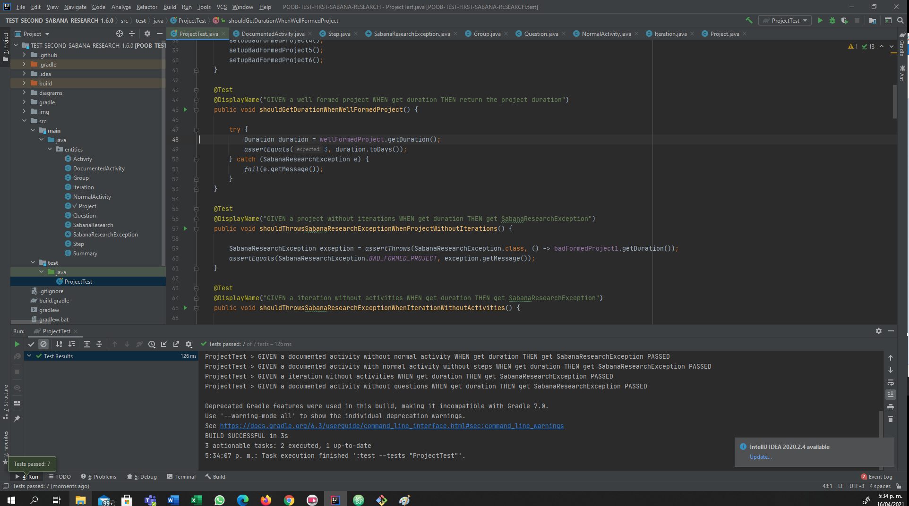

 # IMPLEMENTANDO

 ## Evidencia Pruebas

 

 # CONCEPTOS

 1. ¿Cuáles son las acciones los tres momentos importantes de las excepciones? ¿Cuál es el objetivo de cada una? ¿Cómo se implementa en Java cada acción?.

 Las tres acciones de las excepciones son:

 * Lanzar
 Lazar se encarga de como su nombre lo dice votar la excepcion cuando el metodo se lo indique

 en java se hace mediante

 throw new TipodeExeccion(mensaje)

 * Propagar
 Es el momnto en el que el metodo hace llegar la excepcion a donde sea implementado

 en java se hace mediante en la firma del metodo

 modificadro de acceso - metodo(parametros) throws TipodeExeccion

 * Capturar
 Es el momento en el que un metodo recibe un exepcion y la captura y decide que hacer con ella

 en java se hace con

 try{}
 catch{}
 finally{}       

 2. ¿Qué es sobre-escritura de métodos? ¿Por qué aplicarla? ¿Cómo impedir que se sobre-escriba un método?.

la sobre-escritura es cuando una clase quiere modificar el cuerpo de un metodo que hereda o implementa, esto se hace cuando una clase comparte el metodo pero lo realiza de una forma diferente o se nesesita modificar algo.

para evitar que se pueda modificar se coloca final en la firma del metodo
